> # Даниль Григорьянц (БИВТ-25-1)
> ## Университет МИСИС, Институт компьютерных наук, БИВТ-25-1
> ### Лаборатные работы по Программированию и алгоритмизации (1 семестр)

# Лабораторная работа 1

## Задание 1

```python
name = input()
age = int(input())

print("Привет, %s! Через год тебе будет %d." % (name, age + 1))
```

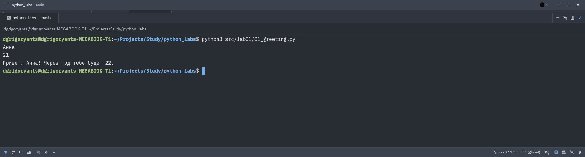

## Задание 2

```python
a = float(input().replace(',', '.'))
b = float(input().replace(',', '.'))

sum = a + b
avg = sum / 2

print("sum=%.2f; avg=%.2f" % (sum, avg))
```

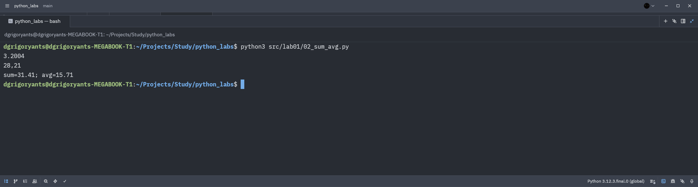

## Задание 3

```python
price = float(input().replace(',', '.'))
discount = float(input().replace(',', '.'))
vat = float(input().replace(',', '.'))

base = price * (1 - discount / 100)
vat_amount = base * (vat / 100)
total = base + vat_amount

print("База после скидки: %.2f ₽" % base)
print("НДС:               %.2f ₽" % vat_amount)
print("Итого к оплате:    %.2f ₽" % total)
```

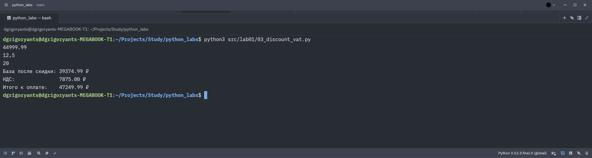

## Задание 4

```python
all_minutes = int(input())

hours = (all_minutes // 60) % 24
minutes = all_minutes % 60

print("%d:%02d" % (hours, minutes))
```


## Задание 5

```python
surname, name, father_name = input().split()

initials = surname[0] + name[0] + father_name[0] + '.'
full_name_len = len(surname) + len(name) + len(father_name) + 2

print("Инициалы: %s" % initials)
print("Длина (символов): %d" % full_name_len)
```

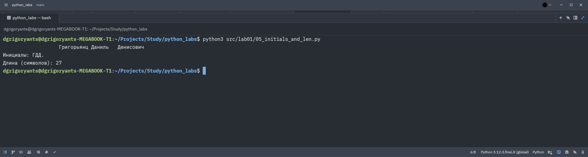

## Задание 6

```python
participants_number = int(input())

intramural = 0
extramural = 0

for i in range(participants_number):
    surname, name, age, participation_format = input().split()
    if participation_format == "True":
        intramural += 1
    else:
        extramural += 1

print(intramural, extramural)
```

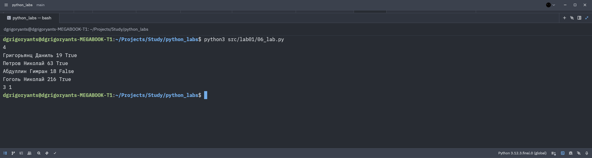

## Задание 7

```python
code = input()

source = ""

for first_letter_number in range(len(code)):
    if code[first_letter_number].isupper():
        for second_letter_number in range(first_letter_number + 1, len(code)):
            if code[second_letter_number].isnumeric():
                for letter_number in range(first_letter_number, len(code), second_letter_number - first_letter_number + 1):
                    source += code[letter_number]
                    if code[letter_number] == '.':
                        break
                break
        break

print(source)
```

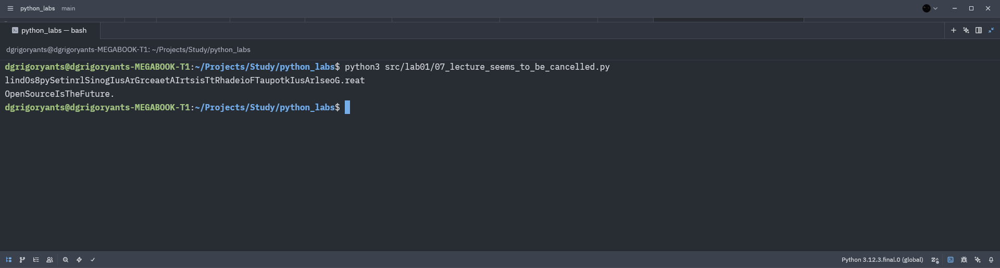

# Лабораторная работа 2

## Проверка функций в каждом файле была реализована подобным кодом:
```python
test_cases = {}
test_cases["function_name"] = [[3, -1, 5, 5, 0], [42], [-5, -2, -9], [], [1.5, 2, 2.0, -3.1]]

print("Тесты функции function_name\n")
for param in test_cases["function_name"]:
    print(f"{str(param):<fancy_number} -> {function_name(param)}")
print()
```
`fancy_number` - это фиксированное для каждого файла число, а `{str(param):<fancy_number>}` выравнивает все ответы для простоты чтения.

## Задание 1

```python
def min_max(nums: list[float | int]) -> tuple[float | int, float | int] | type[ValueError]:
    """Функция выводит минимум и максимум в списке или ValueError, если список пустой"""
    if len(nums) <= 0:
        return ValueError
    
    nums_min, nums_max = min(nums), max(nums)
    return (nums_min, nums_max)


def unique_sorted(nums: list[float | int]) -> list[float | int]:
    """Функция выводит отсортированный список различных элементов вводного списка"""
    return sorted(list(set(nums)))


def flatten(mat: list[list | tuple]) -> list | type[TypeError]:
    """Функция выводит "расплющенный" список списков/кортежей в один список по строкам или TypeError, если в списке встречается не список/кортеж"""
    ret = []
    for row in mat:
        if (not isinstance(row, list)) & (not isinstance(row, tuple)):
            return TypeError
        else:
            ret.extend(row)
    return ret
```

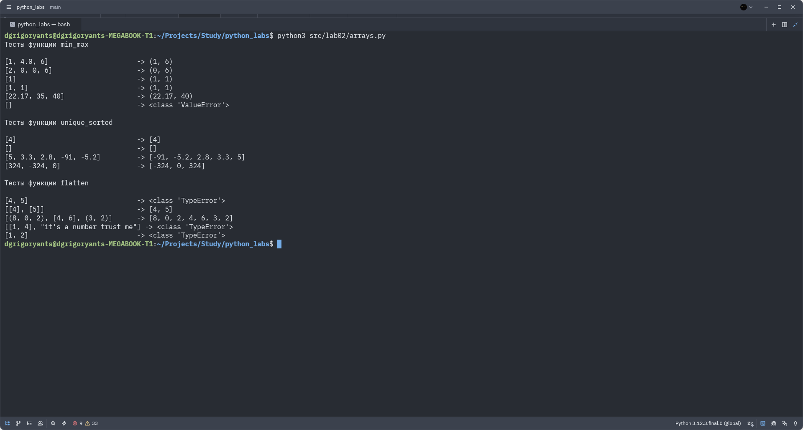

## Задание 2

```python
def width(mat: list[list[float | int]]) -> int:
    """Функция выводит длину строки, если матрица прямоугольная, и -1, если она рваная"""
    if len(mat) == 0:
        return 0
    
    mat_width = len(mat[0])
    for mat_row in mat:
        if len(mat_row) != mat_width:
            return -1
    
    return mat_width


def transpose(mat: list[list[float | int]]) -> list[list[float | int]] | type[ValueError]:
    """Функция транспонирует матрицу или выводит ValueError, если матрица рваная"""
    mat_width = width(mat)
    if mat_width == -1:
        return ValueError
    transposed_mat = [[] for i in range(mat_width)]
    
    for row in mat:
        for column_number, value in enumerate(row):
            transposed_mat[column_number].append(value)
    
    return transposed_mat


def row_sums(mat: list[list[float | int]]) -> list[float] | type[ValueError]:
    """Функция считает суммы значений в строках матрицы или выводит ValueError, если матрица рваная"""
    sums = []
    mat_width = width(mat)
    if mat_width == -1:
        return ValueError
    
    for row in mat:
        sum = 0
        for number in row:
            sum += number
        sums.append(sum)
    
    return sums


def col_sums(mat: list[list[float | int]]) -> list[float] | type[ValueError]:
    """Функция считает суммы значений в столбцах матрицы или выводит ValueError, если матрица рваная"""
    transposed_mat = transpose(mat)
    if transposed_mat is ValueError:
        return ValueError
    return row_sums(transposed_mat)
```

Отдельно была вынесена функция `width`, объединяющая проверку матрицы на прямоугольность и нахождение длины её строки, поскольку её функционал используется в двух функциях, а также может быть использован в будущем.

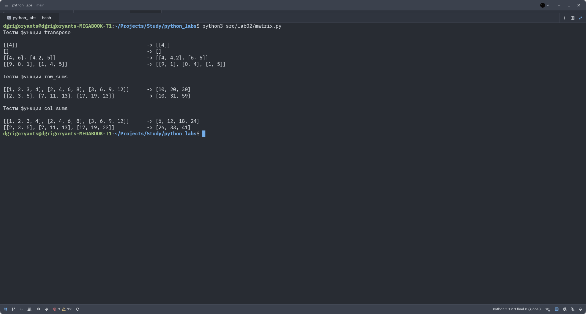

## Задание 3

```python
def format_record(rec: tuple[str, str, float]) -> str | type[ValueError] | type[TypeError]:
    """
    TypeError выводится в случае, если третье значение (GPA) не формата float
    ValueError выводится в случаях, если первое значение (ФИО) состоит из менее двух или более трёх слов или второе значение (название группы) пустое
    """
    if not isinstance(rec[2], float):
        return TypeError
    
    if rec[1] == "":
        return ValueError
    
    name = rec[0].split(" ")
    while "" in name:
        name.remove("")
    
    if len(name) <= 1:
        return ValueError
    elif len(name) > 3:
        return ValueError
    
    return_name = ""
    for part_number, part in enumerate(name):
        if part_number == 0:
            part = part.lower()
            part = "".join([part[0].upper(), part[1:]])
            return_name = "".join([return_name, part, " "])
        else:
            return_name = "".join([return_name, part[0].upper(), "."])
    
    return_group = "".join(["гр. ", rec[1].strip()])
    return_gpa = rec[2]
    return f"{return_name}, {return_group}, {return_gpa:.2f}"
```

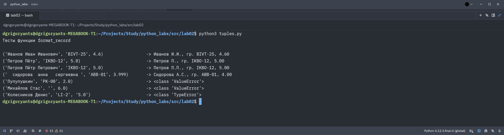

# Лабораторная работа 3

## Проверка функций в файлах была усовершенствованна с прошлой лабораторной работы.

Теперь для запуска и вывода результатов работы функций была реализована специальная функция `test_print`, находящаяся в файле `src/lib/test.py`, необходимая для красивого вывода данных:

```python
import unicodedata

def test_print(test_cases: list[tuple], func, side_size: int) -> bool:
    if not callable(func):
        print("Функцию невозможно вызвать")
        print()
        return False
    
    ret = True
    for value in test_cases:
        cur_side_size = side_size
        result = func(*value[0])
        input_values = ""
        if len(value[0]) == 1:
            input_values = str(value[0][0]).replace("\t", "\\t").replace("\r", "\\r").replace("\n", "\\n")
        else:
            input_values = str(value[0]).replace("\t", "\\t").replace("\r", "\\r").replace("\n", "\\n")[1:-1]
        
        for letter in input_values:
            if unicodedata.east_asian_width(letter) in ("F", "W"):
                cur_side_size -= 1
        
        if result != value[1]:
            ret = False
            print(f"Неверно: {input_values:<{cur_side_size}} -> {result}")
        else:
            print(f"Верно:   {input_values:<{cur_side_size}} -> {result}")
    print()
    return ret
```

## Задание A

```python
def normalize(text: str, *, casefold: bool = True, yo2e: bool = True) -> str:
    if casefold:
       text = text.casefold()
    if yo2e:
        text = text.replace("ё", "е")
    text = text.replace("\t", " ").replace("\r", " ").replace("\n", " ")
    while "  " in text:
        text = text.replace("  ", " ")
    text = text.strip()
    return text

def tokenize(text: str) -> list[str]:
    while "--" in text:
        text = text.replace("--", " ")
    for letter in text:
        if not (letter.isalnum() or letter == "_" or letter == "-"):
            text = text.replace(letter, " ")
    splitted = text.split()
    ret = []
    for item in splitted:
        while item[0] == "-":
            item = item[1:]
        while item[-1] == "-":
            item = item[:-1]
        ret.append(item)
    return ret

def count_freq(tokens: list[str]) -> dict[str, int]:
    ret = {}
    for word in tokens:
        ret[word] = ret.get(word, 0) + 1
    return ret

def top_n(freq: dict[str, int], n: int = 5) -> list[tuple[str, int]]:
    sorted = []
    for value in freq.items():
        sorted.append((-value[1], value[0]))
    sorted.sort()
    ret = []
    for value in sorted:
        ret.append((value[1], -value[0]))
    return ret[0: n]
```

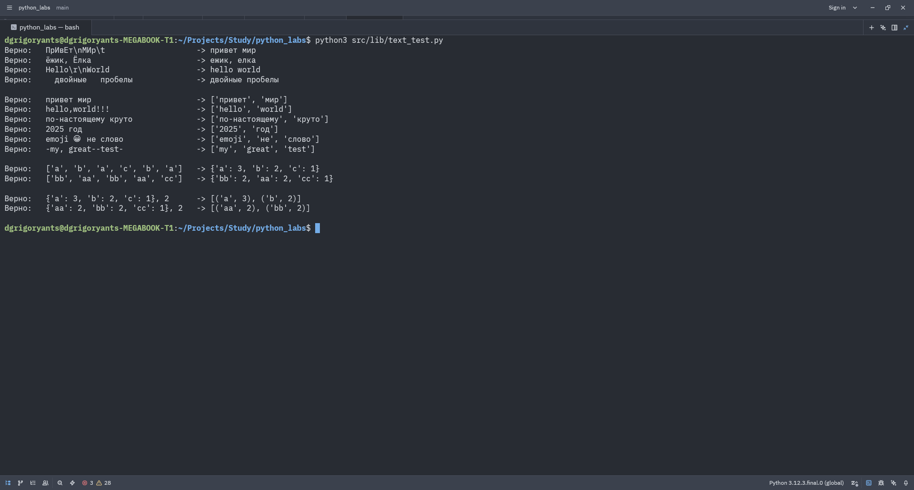

## Задание B

```python
import sys
sys.path.insert(0, "src")
from lib.text import *

def text_stats(in_text: str) -> None:
    in_text = normalize(in_text)
    tokens = tokenize(in_text)
    unique_words = count_freq(tokens)
    top_5 = top_n(unique_words)
    
    print(f"Всего слов: {len(tokens)}")
    print(f"Уникальных слов: {len(unique_words)}")
    print("Топ-5:")
    
    width = 5
    for item in top_5:
        width = max(width, len(item[0]))
    
    print(f"{"слово":<{width}} | частота")
    print("-" * (width + 10))
    for item in top_5:
        print(f"{item[0]:<{width}} | {item[1]}")


if __name__ == "__main__":
    text_stats(input())
```

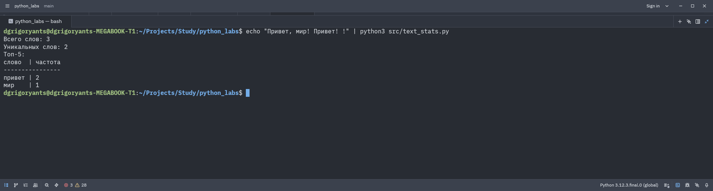

Проверка проводилась запуском программы напрямую командой `echo "какой-то текст" | python3 scr/text_stats.py"`

# Лабораторная работа 4

## Задание A

```python
import sys
sys.path.insert(0, "src")
import csv
from typing import Iterable, Sequence

def read_text(path: str, encoding: str = "utf-8") -> str:
    """Возвращает весь текст, находящийся в файле.
    
    :param path: путь до файла
    :type path: str
    :param encoding: кодировка текста (по умолчанию utf-8)
    :type encoding: str
    
    :raises FileNotFoundError: если файл не найден
    :raises UnicodeDecodeError: если кодировка не подходит
    
    :return: текст, находящийся в файле
    :rtype: str"""
    
    ret = ""
    with open(path, "r", encoding=encoding) as f:
        for line in f:
            ret = "\n".join([ret, line.strip()])
    return ret[1:]

def write_csv(rows: Iterable[Sequence], path: str | Path, header: tuple[str, ...] | None = None) -> None:
    """По указанному пути перезаписывает (или создаёт и записывает) файл формата csv с данными переданной таблицы.
    
    :param rows: данные таблицы
    :type rows: Iterable[Sequence]
    :param path: путь до файла
    :type path: str | Path
    :param heading: строка заголовка (опционально)
    :type heading: tuple[str, ...]
    
    :raises ValueError: если строки таблицы имеют разную длину
    
    :return: функция записывает данные таблицы в файл
    :rtype: None"""
    
    p = Path(path)
    table = []
    if header is not None:
        table.append(header)
    table.extend(list(rows))
    
    if (len(table) > 0):
        row_len = len(table[0])
        for row_number, row in enumerate(table):
            if len(row) != row_len:
                raise ValueError(f"Строки должны иметь одинаковую длину, но у строки {row_number} длина не совпадает с длиной строки 0.")
    
    with p.open("w", newline="", encoding="utf-8") as f:
        w = csv.writer(f)
        for row in table:
            w.writerow(row)

if __name__ == "__main__":
    print(read_text("data/lab04/input.txt"))
    write_csv([("мама", 3), ("папа", 1)], "data/lab04/check01.csv", ("слово", "частота"))
    write_csv([("слово", "частота"), ("мама", 3), ("папа", 1)], "data/lab04/check02.csv")
    write_csv([], "data/lab04/check03.csv", ("слово", "частота"))
    write_csv([], "data/lab04/check04.csv")
```

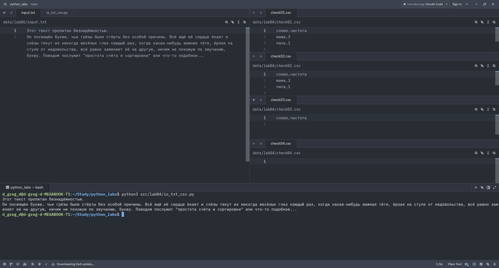

## Задание B

```python
import sys
sys.path.insert(0, "src")

if __name__ == "__main__":
    from lib.text import normalize, tokenize, count_freq, top_n
    from lab04.io_txt_csv import read_text, write_csv
    from lab03.text_stats import text_stats
    
    text = read_text("data/lab04/input.txt")
    table = top_n(count_freq(tokenize(normalize(text))))
    write_csv(table, "data/lab04/report.csv", ("слово", "частота"))
    text_stats(text)
```

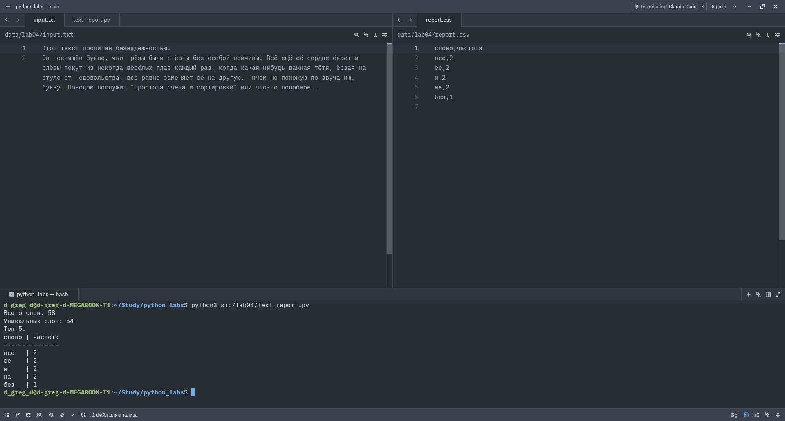

# Лабораторная работа 5

## Задание A

```python
import sys
sys.path.insert(0, "")
import json
import csv

def json_to_csv(json_path: str, csv_path: str) -> None:
    """
    Преобразует JSON-файл в CSV.
    Кодировка UTF-8. Порядок колонок — алфавитный.
    """
    with open(json_path, "r", encoding="utf-8") as fin:
        jsonin = json.load(fin)
    if isinstance(jsonin, dict):
        jsonin = [jsonin]
    elif not isinstance(jsonin, list):
        raise ValueError("Пустой JSON или неподдерживаемая структура")
    header = []
    for item in jsonin:
        if not isinstance(item, dict):
            raise ValueError("Пустой JSON или неподдерживаемая структура")
        header.extend(item.keys())
    header = sorted(list(set(header)))
        
    with open(csv_path, "w", encoding="utf-8") as fout:
        csvout = csv.DictWriter(fout, fieldnames=header)
        csvout.writeheader()
        for entry in jsonin:
            csvout.writerow(entry)

def csv_to_json(csv_path: str, json_path: str) -> None:
    """
    Преобразует CSV в JSON (список словарей).
    """
    with open(csv_path, "r", encoding="utf-8") as fin:
        csvin = list(csv.DictReader(fin))
        if len(csvin) == 0:
            raise ValueError("Пустой CSV")
        with open(json_path, "w", encoding="utf-8") as fout:
            json.dump(csvin, fout, ensure_ascii=False, indent=2)
```

В функции `json_to_csv` был выбран алфавитный порядок колонок как более простой и понятный, ибо не все колонки могут иметь значения для первого элемента.

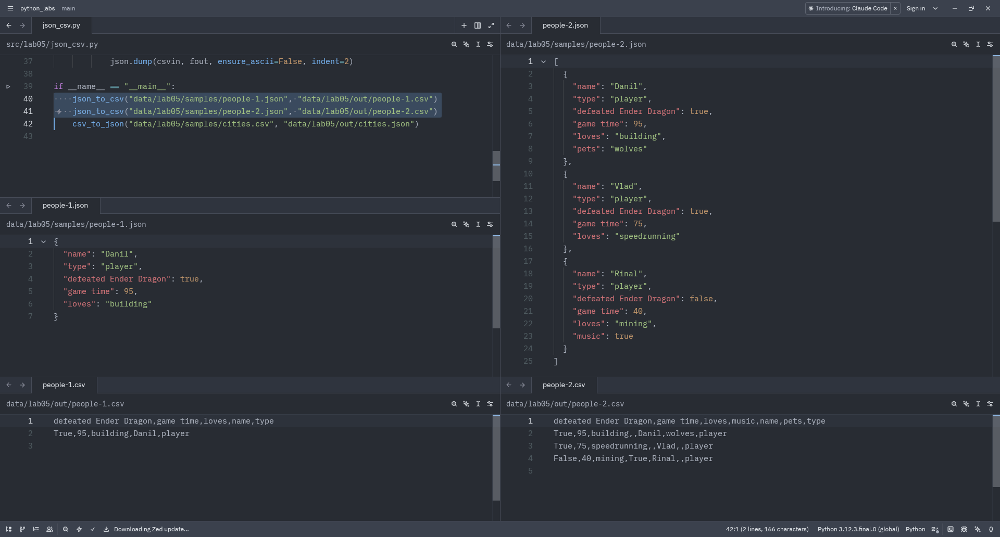
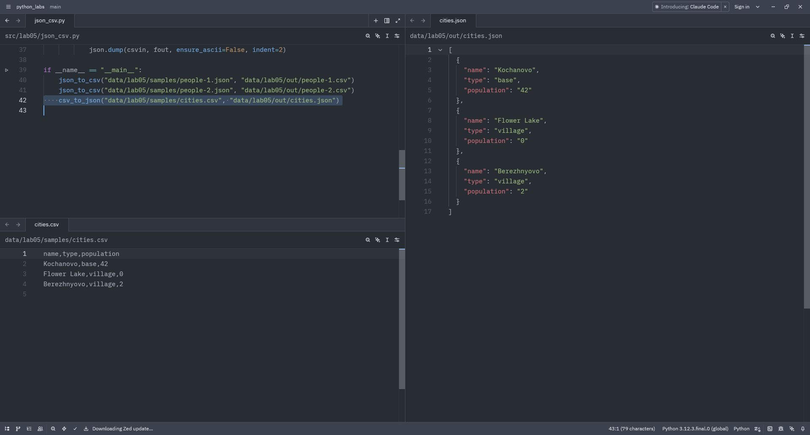

## Задание B

```python
import sys
sys.path.insert(0, "")
from openpyxl import Workbook
import csv

def csv_to_xlsx(csv_path: str, xlsx_path: str) -> None:
    """
    Конвертирует CSV в XLSX.
    """
    inputSize = True
    
    wb = Workbook()
    ws = wb.active
    ws.title = "Sheet1"
    
    with open(csv_path, "r", encoding="utf-8") as fin:
        for row in csv.reader(fin):
            inputSize = False
            ws.append(row)
    if inputSize:
        raise ValueError("Пустой CSV")
    
    for column in ws.columns:
        #length = max(len(str(cell.value)) for cell in column)
        length = max(map(lambda cell: len(str(cell.value)), column))
        ws.column_dimensions[column[0].column_letter].width = max(8, length) * 1.2
    
    wb.save(xlsx_path)
```

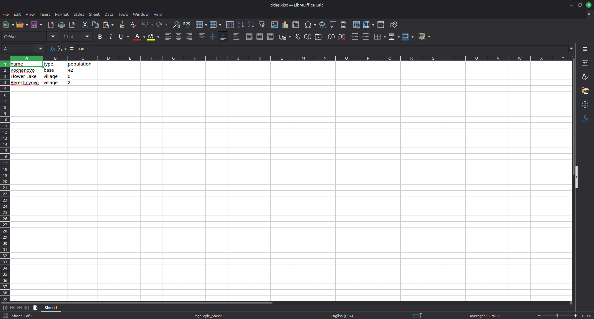

# Лабораторная работа 6

## cli_text.py

```python
import argparse
from src.lib.text import normalize, tokenize, count_freq, top_n

def main() -> None:
    parser = argparse.ArgumentParser(description="CLI‑утилиты лабораторной №6")
    subparsers = parser.add_subparsers(dest="command")

    cat_parser = subparsers.add_parser("cat", help="Вывести содержимое файла")
    cat_parser.add_argument("--input", required=True)
    cat_parser.add_argument("-n", action="store_true", help="Нумеровать строки")

    stats_parser = subparsers.add_parser("stats", help="Вывести топ самых частых слов")
    stats_parser.add_argument("--input", required=True)
    stats_parser.add_argument("--top", type=int, default=5, help="Количество слов в топе")

    args = parser.parse_args()
    
    text = []
    try:
        with open(args.input, "r") as f:
            for line in f:
                text.append(line)
    except FileNotFoundError:
        raise FileNotFoundError("Входной файл не найден")

    if args.command == "cat":
        for line_number, line in enumerate(text):
            if args.n:
                print(line_number + 1, line)
            else:
                print(line)
            
    elif args.command == "stats":
        top = top_n(count_freq(tokenize(normalize("\n".join(text)))), args.top)
        
        print(f"Топ-{args.top}:")
        
        width = 5
        for item in top:
            width = max(width, len(item[0]))
        
        print(f"{"слово":<{width}} | частота")
        print("-" * (width + 10))
        for item in top:
            print(f"{item[0]:<{width}} | {item[1]}")


if __name__ == "__main__":
    main()
```

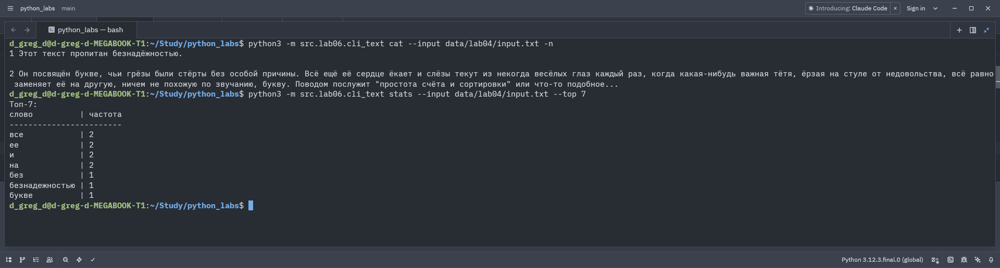

## cli_convert.py

```python
import argparse
from src.lab05.json_csv import json_to_csv, csv_to_json
from src.lab05.csv_xlsx import csv_to_xlsx

def main() -> None:
    parser = argparse.ArgumentParser(description="Конвертеры данных")
    subparsers = parser.add_subparsers(dest="command")

    p1 = subparsers.add_parser("json2csv")
    p1.add_argument("--in", dest="input", required=True)
    p1.add_argument("--out", dest="output", required=True)

    p2 = subparsers.add_parser("csv2json")
    p2.add_argument("--in", dest="input", required=True)
    p2.add_argument("--out", dest="output", required=True)

    p3 = subparsers.add_parser("csv2xlsx")
    p3.add_argument("--in", dest="input", required=True)
    p3.add_argument("--out", dest="output", required=True)

    args = parser.parse_args()

    if args.command == "json2csv":
        if args.input[-5:] != ".json":
            parser.error("Формат входного файла неверный. Используйте --help для помощи")
        elif args.output[-4:] != ".csv":
            parser.error("Формат выходного файла неверный. Используйте --help для помощи")
        else:
            try:
                json_to_csv(args.input, args.output)
            except FileNotFoundError:
                raise FileNotFoundError("Входной файл не найден.")
    elif args.command == "csv2json":
        if args.input[-4:] != ".csv":
            parser.error("Формат входного файла неверный. Используйте --help для помощи")
        elif args.output[-5:] != ".json":
            parser.error("Формат выходного файла неверный. Используйте --help для помощи")
        else:
            try:
                csv_to_json(args.input, args.output)
            except FileNotFoundError:
                raise FileNotFoundError("Входной файл не найден.")
    elif args.command == "csv2xlsx":
        if args.input[-4:] != ".csv":
            parser.error("Формат входного файла неверный. Используйте --help для помощи")
        elif args.output[-5:] != ".xlsx":
            parser.error("Формат выходного файла неверный. Используйте --help для помощи")
        else:
            try:
                csv_to_xlsx(args.input, args.output)
            except FileNotFoundError:
                raise FileNotFoundError("Входной файл не найден.")


if __name__ == "__main__":
    main()
```

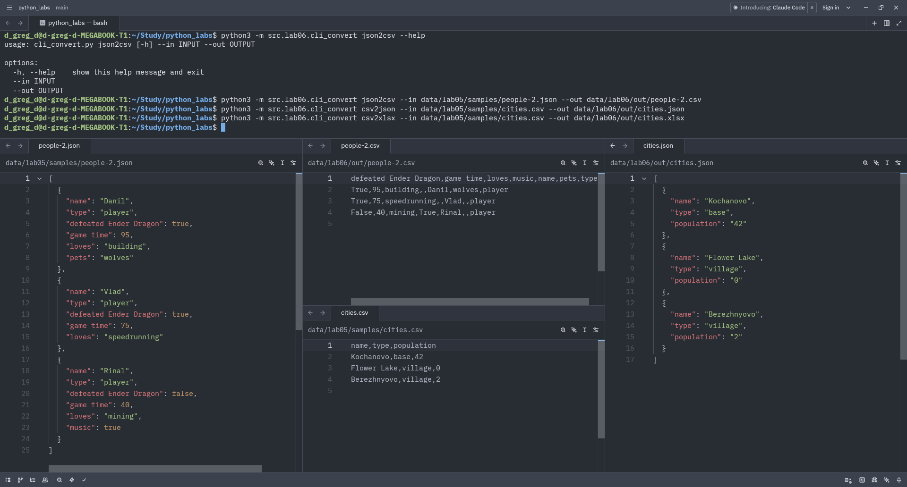

# Лабораторная работа 7

## test_text.py

```python
import pytest
import sys

sys.path.insert(0, "")
from src.lib.text import normalize, tokenize, count_freq, top_n


@pytest.mark.parametrize(
    "source, casefold, yo2e, expected",
    [
        ("ПрИвЕт\nМИр\t", True, True, "привет мир"),
        ("ёжик, Ёлка", True, True, "ежик, елка"),
        ("Hello\r\nWorld", True, True, "hello world"),
        ("  двойные   пробелы  ", True, True, "двойные пробелы"),
        ("Ё выживет", True, False, "ё выживет"),
        ("БОЛЬШИЕ", False, True, "БОЛЬШИЕ"),
    ],
)
def test_normalize_basic(source, casefold, yo2e, expected):
    assert normalize(source, casefold=casefold, yo2e=yo2e) == expected


@pytest.mark.parametrize(
    "source, expected",
    [
        ("привет мир", ["привет", "мир"]),
        ("hello,world!!!", ["hello", "world"]),
        ("по-настоящему круто", ["по-настоящему", "круто"]),
        ("2025 год", ["2025", "год"]),
        ("emoji 😀 не слово", ["emoji", "не", "слово"]),
        ("-my, great--test-", ["my", "great", "test"]),
    ],
)
def test_tokenize_basic(source, expected):
    assert tokenize(source) == expected


@pytest.mark.parametrize(
    "source, expected",
    [
        (["a", "b", "a", "c", "b", "a"], {"a": 3, "b": 2, "c": 1}),
        (["bb", "aa", "bb", "aa", "cc"], {"aa": 2, "bb": 2, "cc": 1}),
    ],
)
def test_count_freq(source, expected):
    assert count_freq(source) == expected


@pytest.mark.parametrize(
    "source, n, expected",
    [
        ({"a": 3, "b": 2, "c": 1}, 2, [("a", 3), ("b", 2)]),
        ({"aa": 2, "bb": 2, "cc": 1}, 2, [("aa", 2), ("bb", 2)]),
    ],
)
def test_top_n(source, n, expected):
    assert top_n(source, n) == expected
```

## test_json_csv.py

```python
import pytest
import csv
import json
import sys

sys.path.insert(0, "")
from src.lab05.json_csv import json_to_csv, csv_to_json


@pytest.mark.parametrize(
    "data, expected_len, expected_keys, expected_rows",
    [
        (
            [
                {
                    "name": "Danil",
                    "type": "player",
                    "defeated Ender Dragon": True,
                    "game time": 95,
                    "loves": "building",
                    "pets": "wolves",
                },
                {
                    "name": "Vlad",
                    "type": "player",
                    "defeated Ender Dragon": True,
                    "game time": 75,
                    "loves": "speedrunning",
                },
                {
                    "name": "Rinal",
                    "type": "player",
                    "defeated Ender Dragon": False,
                    "game time": 40,
                    "loves": "mining",
                    "music": True,
                },
            ],
            3,
            {
                "defeated Ender Dragon",
                "game time",
                "loves",
                "music",
                "name",
                "pets",
                "type",
            },
            [
                {
                    "defeated Ender Dragon": "True",
                    "game time": "95",
                    "loves": "building",
                    "music": "",
                    "name": "Danil",
                    "pets": "wolves",
                    "type": "player",
                },
                {
                    "defeated Ender Dragon": "True",
                    "game time": "75",
                    "loves": "speedrunning",
                    "music": "",
                    "name": "Vlad",
                    "pets": "",
                    "type": "player",
                },
                {
                    "defeated Ender Dragon": "False",
                    "game time": "40",
                    "loves": "mining",
                    "music": "True",
                    "name": "Rinal",
                    "pets": "",
                    "type": "player",
                },
            ],
        ),
        ([], 0, {}, []),
    ],
)
def test_json_to_csv(tmp_path, data, expected_len, expected_keys, expected_rows):
    src = tmp_path / "people.json"
    dst = tmp_path / "people.csv"
    src.write_text(json.dumps(data, ensure_ascii=False, indent=2), encoding="utf-8")
    json_to_csv(str(src), str(dst))

    with dst.open(encoding="utf-8") as f:
        rows = list(csv.DictReader(f))

    assert len(rows) == expected_len
    if len(rows) == 0:
        return
    assert expected_keys <= set(rows[0].keys())
    for i in range(len(rows)):
        assert expected_rows[i] == rows[i]


def test_csv_to_json(tmp_path):
    src = tmp_path / "cities.csv"
    dst = tmp_path / "cities.json"
    data = "name,type,population\nKochanovo,base,42\nFlower Lake,village,0\nBerezhnyovo,village,2"
    src.write_text(data)
    csv_to_json(str(src), str(dst))

    with dst.open(encoding="utf-8") as f:
        ans = json.load(f)

    assert ans == [
        {"name": "Kochanovo", "type": "base", "population": "42"},
        {"name": "Flower Lake", "type": "village", "population": "0"},
        {"name": "Berezhnyovo", "type": "village", "population": "2"},
    ]
```

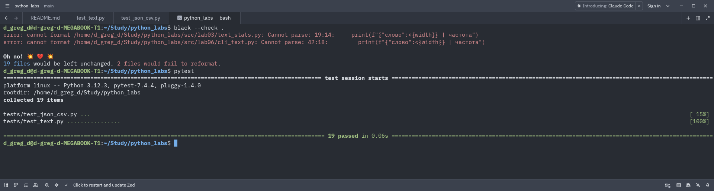

# Лабораторная работа 8

## models.py

```python
from dataclasses import dataclass
from datetime import datetime
from datetime import date

@dataclass
class Student:
    fio: str
    birthdate: str
    group: str
    gpa: float

    def __post_init__(self):
        try:
            datetime.strptime(self.birthdate, "%Y-%m-%d")
        except:
            raise ValueError("Формат даты должен быть YYYY-MM-DD")
        
        if not (0 <= self.gpa <= 5):
            raise ValueError("GPA должен быть между 0 и 5")

    def age(self) -> int:
        self.__post_init__()
        b = self.birthdate
        today = date.today()
        return today.year - int(b.split("-")[0]) - (today.month < int(b.split("-")[1]) or (today.month == int(b.split("-")[1] and today.day < int(b.split("-")[2]))))

    def to_dict(self) -> dict:
        self.__post_init__()
        return {
            "fio": self.fio,
            "birthdate": self.birthdate,
            "group": self.group,
            "gpa": self.gpa,
        }

    @classmethod
    def from_dict(cls, d: dict):
        fio = d.get("fio", "")
        birthdate = d.get("birthdate", "")
        group = d.get("group", "")
        gpa = d.get("gpa", 0)
        return cls(fio, birthdate, group, gpa)

    def __str__(self):
        return f"ФИО: {self.fio}\nДата рождения: {self.birthdate}\nГруппа: {self.group}\nGPA: {self.gpa}\n"
```

## serialize.py

```python
import json
import sys
sys.path.insert(0, "")
from src.lab08.models import Student

def students_to_json(students, path):
    data = [s.to_dict() for s in students]
    with open(path, "w", encoding="utf-8") as file:
        json.dump(data, file, ensure_ascii=False, indent=2)

def students_from_json(path) -> list[Student]:
    with open(path, "r", encoding="utf-8") as file:
        data = json.load(file)
    if not isinstance(data, list):
        data = [data]
    ret = []
    for info in data:
        student = Student(info.get("fio", ""), info.get("birthday", ""), info.get("group", ""), info.get("gpa", ""))
        student.__post_init__()
        ret.append(student)
    return ret

if __name__ == "__main__":
    students = students_from_json("data/lab08/students_input.json")
    for student in students:
        print(f"{student.__str__()}Возраст: {student.age()}\n")
    students_to_json(students, "data/lab08/students_output.json")
```

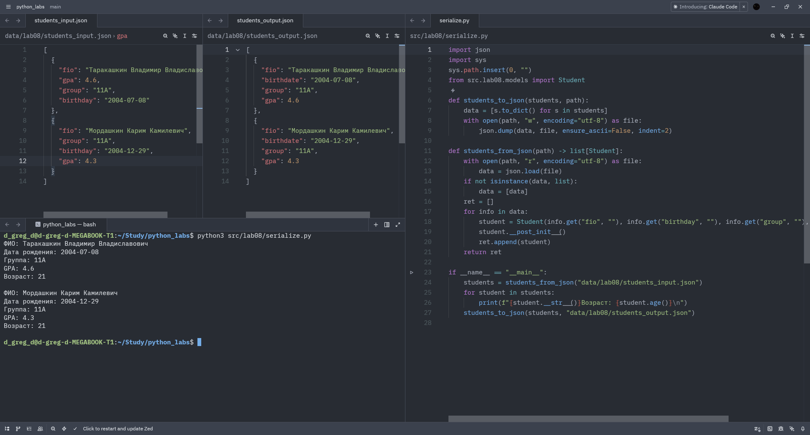
